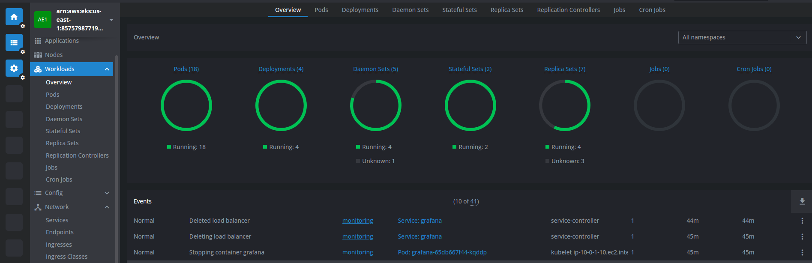
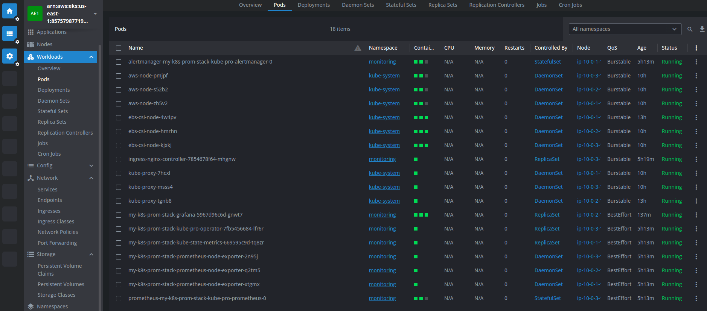
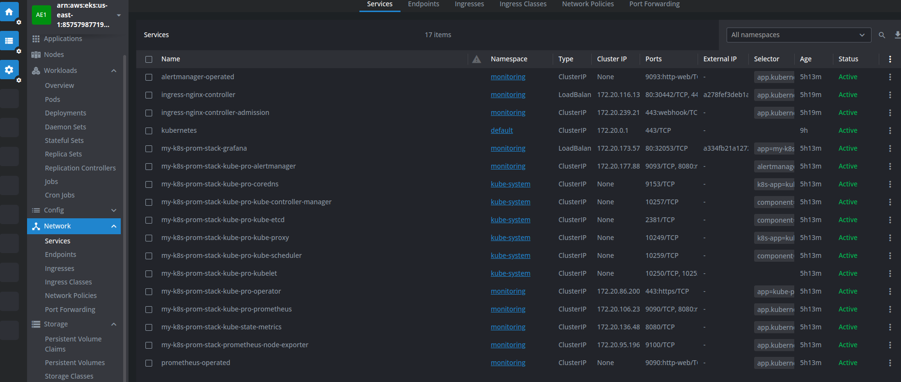
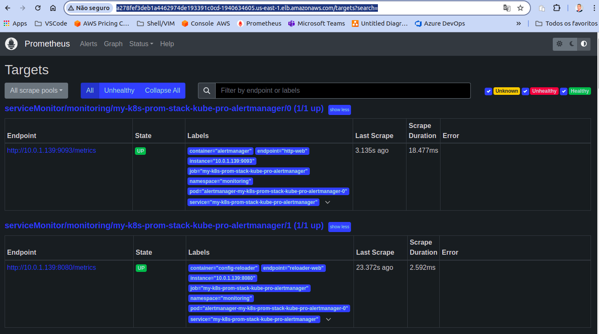

# fast-teste-ops

# Instalação do Kubernetes EKS

Utilizando terraform.

Comandos utilizados:

terraform init

terraform plan

terraform apply

terraform destroy

kubectl create namespace monitoring

kubectl -n monitoring apply -f nginx-ingress-controllers-prometheus.yaml

kubectl get svc --namespace monitoring 

kubectl get pods --namespace monitoring

kubectl get prometheus --namespace monitoring

# Instalação do Ingress:

Criação do arquivo de manifesto, nginx-ingress-controllers-prometheus.

# Instalação da Stack do Prometheus e Grafana:

instalação do Prometheus e o Grafana via Helm Chart.

Comandos utilizados:

helm repo add prometheus-community https://prometheus-community.github.io/helm-charts 
helm repo update 

helm install my-k8s-prom-stack prometheus-community/kube-prometheus-stack --namespace monitoring

helm repo add ingress-nginx https://kubernetes.github.io/ingress-nginx 
helm repo update

helm install ingress-nginx ingress-nginx/ingress-nginx --namespace monitoring
--set controller.metrics.enabled=true \
--set controller.metrics.serviceMonitor.enabled=true \
--set controller.metrics.serviceMonitor.additionalLabels.release="my-k8s-prom-stack" \
--version=4.5.2

helm install ingress-nginx ingress-nginx/ingress-nginx --namespace monitoring-2
--set controller.metrics.enabled=true \
--set controller.metrics.serviceMonitor.enabled=true \
--set controller.metrics.serviceMonitor.additionalLabels.release="my-k8s-prom-stack" \
--version=4.5.2

Gerenciamento do cluster utilizado Lens

URL de acesso da stack Prometheus

http://a278fef3deb1a4462974de193391c0cd-1940634605.us-east-1.elb.amazonaws.com

